# PDA2 — a PDA firmware for the LilyGo T-Deck Pro

An offline-first PDA firmware for the **LilyGo T-Deck Pro v1.1**: reader, dictionary, vector maps, notes, weather, world clock, GPS tracker and more, on a 240×320 monochrome e-paper screen with a hardware keyboard. **All written by Claude**

Built on top of LilyGo's factory example, which supplies the proven hardware drivers (e-paper, touch, keypad, GPS, LoRa, power management), with the PDA apps layered on top.

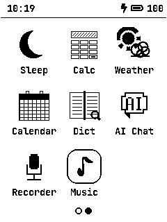
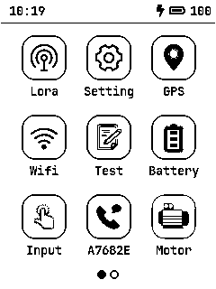

---

## Contents

- [Hardware](#hardware)
- [Building and flashing](#building-and-flashing)
- [First-time setup](#first-time-setup)
  - [API keys and WiFi](#api-keys-and-wifi)
  - [SD card layout](#sd-card-layout)
  - [CJK fonts](#cjk-fonts)
  - [Maps](#maps)
  - [Dictionaries](#dictionaries)
  - [Books](#books)
- [User guide](#user-guide)
- [Development notes](#development-notes)
  - [Adding a setting](#adding-a-setting)
  - [Known gaps](#known-gaps)

---

## Hardware

| | |
|---|---|
| MCU | ESP32-S3, 240 MHz, 8 MB PSRAM, 16 MB flash |
| Display | 3.1″ e-paper, 240×320, monochrome (GDEQ031T10) |
| Keyboard | TCA8418 4×10 matrix, with `sym` / `alt` / shift modifiers |
| Touch | CST226SE capacitive |
| Radios | WiFi, BLE, SX1262 LoRa, A7682E LTE modem |
| Sensors | u-blox GNSS, BHI260AP IMU |
| Power | BQ25896 charger, BQ27220 fuel gauge |
| Other | DRV2605 haptics, PCM5102A audio out, PDM microphone, microSD |

The e-paper panel takes roughly **400 ms** for a full refresh. That single number shapes most of the UI: pages rather than smooth scrolling, no animations, no blinking cursors.

---

## Building and flashing

### Prerequisites

- [PlatformIO](https://platformio.org/) (CLI or the VS Code extension)
- A USB-C cable

### Build

The repository root is a PlatformIO project. `platformio.ini` already selects this example:

```ini
src_dir = examples/pda2
default_envs = T-Deck-Pro
```

From the repository root:

```bash
pio run                 # build
pio run -t upload       # build and flash
pio device monitor      # serial console at 115200 baud
```

If `pio` isn't on your `PATH`, it usually lives at `~/.platformio/penv/bin/pio`.

To build a different example, change `src_dir` in `platformio.ini`.

### Notes on rebuilding

- Editing `config/lv_conf.h` does **not** trigger an LVGL rebuild. Force it:
  ```bash
  rm -rf .pio/build/T-Deck-Pro/lib876
  ```
- The serial monitor has the exception decoder enabled, so a crash prints a decoded backtrace.

---

## First-time setup

### API keys and WiFi

There are two ways to set these, and you can mix them.

**On the SD card** (no rebuild needed) — copy `config_keys.ini.example` to the
root of the card as `config_keys.ini` and edit it there:

```ini
wifi_ssid     = my-network
wifi_password = my-password
owm_api_key   = 0123456789abcdef
```

One `key = value` per line; `#` and `;` start comments; `[sections]` are
ignored; keys are case-insensitive; quote a value to keep leading or trailing
spaces. The file is read once at boot and reported on serial by name and
length only — values are never logged.

**Compiled in** — copy the header template and rebuild:

```bash
cp examples/pda2/config_keys.h.example examples/pda2/config_keys.h
```

`config_keys.h` is **gitignored** — it holds real credentials and must not be
committed.

**Precedence: the card wins.** Anything the `.ini` does not mention keeps the
value compiled in, so adding a card file changes only the settings it names.
Firmware with no keys at all still runs; apps that need a missing one say so.

> The file server refuses to list, serve or delete `config_keys.ini`, since the
> card is otherwise browsable by anyone who can reach the device. That is not a
> substitute for physical care: anyone holding the card can read it.

| `.ini` key / `.h` define | Needed for | Where to get it |
|---|---|---|
| `wifi_ssid`, `wifi_password` | Weather, AI Chat, Files, holidays, time sync | your network |
| `owm_api_key` | Weather | [openweathermap.org](https://openweathermap.org/api) — One Call API 3.0 |
| `gemini_api_key` | AI Chat | [aistudio.google.com](https://aistudio.google.com/) |
| `calendarific_api_key` | Public holidays in Calendar | [calendarific.com](https://calendarific.com/) |
| `calendar_countries` | Which countries' holidays — e.g. `US,CN` | — |
| `ublox_assistnow_token` | Faster first GPS fix (optional) | u-blox AssistNow |

Everything except WiFi is optional; apps that need a missing key say so rather than failing silently.

### SD card layout

Format the card as **FAT32**. exFAT will not mount — this firmware's FatFs is built with `FF_FS_EXFAT 0`, which matters because macOS and Windows format cards over 32 GB as exFAT by default.

```
/books/         .epub, .md, .txt        Reader
/stardict/      .ifo .idx .dict         StarDict dictionaries
/fonts/         cjk_14.bin, cjk_16.bin  CJK glyphs (see below)
/gpx/           written by the GPS tracker
/images/        .png, .jpg, .bmp        Image viewer
/maps/          .img (Garmin)           Map on GPS page 2
/music/         audio files             Music player
/notes/         .md                     Notes
/recordings/    written by the recorder
config_keys.ini optional settings (see above)
```

Directories are created on demand where the app writes; you only need to create the ones you're putting content into.

### CJK fonts

Chinese, Japanese and Korean glyphs are **pre-rasterized offline**. Rendering TTF glyphs at runtime takes 1–2 seconds *each* on this MCU — a screen of Chinese took minutes — so the glyphs are baked into a flat bitmap blob loaded into PSRAM at boot. You could got TTF fonts from [Google fonts](https://fonts.google.com/noto/specimen/Noto+Sans+SC)

```bash
python3 tools/rasterize_cjk_font.py \
    --font /path/to/NotoSansSC-Regular.otf \
    --size 14 --out cjk_14.bin
```

Copy the result to `/fonts/cjk_14.bin` on the card. The 14 px size matches the body font; `cjk_16.bin` is an optional larger spare.

Useful options:

- `--ranges 0x4E00-0x9FFF,0x3000-0x303F` — pick specific Unicode ranges
- `--ext-a` — include CJK Extension A (much larger output)
- `--charset-file notes.txt` — only rasterize characters that appear in a given file, for a much smaller blob

Without this file, CJK text renders as blanks. Latin text is unaffected.

### Maps

The map viewer reads **classic (unencrypted) Garmin `.img` files** — the format `mkgmap` produces, which is what every OSM-derived Garmin map uses. Garmin's newer "NT" format is rejected at open with a clear message rather than mis-drawn.

1. Download a region from [garmin.opentopomap.org](https://garmin.opentopomap.org/) — each region offers a base map and an optional contours overlay.
2. **Unzip it** and copy the `.img` to `/maps/` on the card.
3. Open **GPS → page 2 (Map)** and tap the map name at the bottom to pick it.

> A `.zip` dropped in `/maps/` also works — the firmware unpacks it once, on device. But that path is capped at 6 MB uncompressed (the decompressor is one-shot and needs the whole output in RAM), so anything country-sized must be unzipped on a computer.

**First open builds an index** of every tile in the file, which for a multi-gigabyte map takes a while and reports progress on serial. The result is cached in a `.tdx` sidecar next to the map, so every open after that is roughly a second.


### Dictionaries

Put **StarDict** dictionaries in `/stardict/` (the `.ifo`, `.idx` and `.dict`/`.dict.dz` files together). Several dictionaries can be installed at once; the Dictionary app's gear button chooses which take part in lookups. You could got dictionaries from [dioxionary](https://github.com/vaaandark/dioxionary)

Indexes for enabled dictionaries are loaded into PSRAM when the app opens — a multi-megabyte read from SD — so the first lookup is instant rather than stalling for seconds.

### Books

Copy `.epub`, `.md` or `.txt` files to `/books/`. EPUBs must be unencrypted; DRM-protected files are detected and reported.


---

## User guide

### Getting around

- **Swipe left/right** on the home screen to change page; tap an icon to open an app.
- **Backspace** goes back a page, then leaves the app.
- **Enter** or **space** moves to the next page within an app.
- Most apps show `Name [2/4]` at the bottom to say where you are.
- **Alt+P** saves a screenshot of the current screen to `/images` as a 1-bpp BMP — which is how the screenshots in this README were taken.

Apps hold the radios they need only while open. Leaving an app releases WiFi immediately and GPS after a warm-up window, so nothing stays powered because a screen forgot to turn it off.

### GPS

Four pages: **Overview**, **Map**, **Tracker**, **Tracks**.

| Key | Action |
|---|---|
| `w` `a` `s` `d` | pan the map |
| `i` / `o` | zoom in / out |
| `g` | re-lock the view onto your position |
| `c` | contour lines on/off (persists) |
| `s` (Tracker page) | start / stop recording |

On-screen **＋**, **−** and **⌖** buttons do the same as `i`, `o` and `g`.

The map draws roads, water, boundaries and terrain from the Garmin file, with your track and position overlaid. Line styles: long dash for shorelines, rivers, boundaries and area outlines; dotted for trails and contours; solid for roads and railways; heavier for motorways.

Zooming out is refused when the view would span more tiles than a redraw can read off the card — a zoom limit is better than a redraw that never finishes.

**Recording a track** holds the GPS powered and keeps the CPU at full speed even with no input, so a recording doesn't die when the device would otherwise idle. Tracks are written to `/gpx/` as standard GPX and can be listed and deleted on page 4.

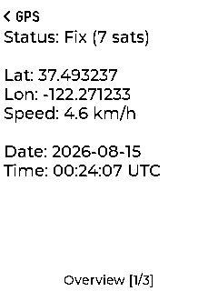
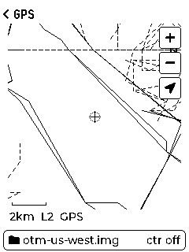
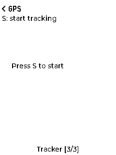
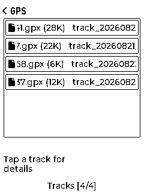

### Reader

Reads **EPUB**, **Markdown** and **plain text** from `/books/`.

| Key | Action |
|---|---|
| space, `m`, `s` | next page |
| `n`, `w` | previous page |
| `i` / `o` | larger / smaller text |

EPUB support is deliberately narrow: no images (alt text is shown instead), a single body font, chapters rendered continuously with a chapter list on page 3. Markdown gets headings, bullets, numbered lists, code blocks and rules.

Your position is remembered per file, so closing a book and coming back returns to the same page.


### Dictionary

Type a word and press **Enter**. Every enabled dictionary that has the word contributes an entry under its own heading.

- The **gear** beside the search box chooses which dictionaries to use.
- **Tap the top or bottom half** of the results to page up or down; dragging scrolls freely.
- Queries are logged to `/dict_history.csv` with a timestamp.

If nothing offline matches, it suggests near spellings, then tries an online lookup if WiFi is available.


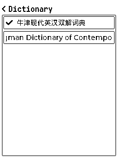

### Weather

Three pages: current conditions, 12-hour forecast, 8-day forecast. Tap the city name to change location — type to search from the built-in city database, or choose **Use GPS location** to follow your position again. Results are cached for an hour.

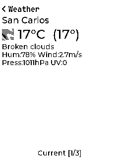
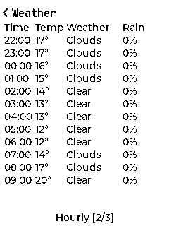
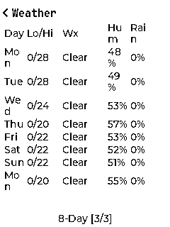
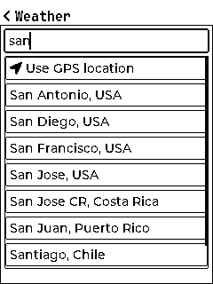

### World clock

Up to six cities at once. Page 2 has a world map for browsing by timezone plus a typeahead city search; tap to add or remove.

Both this and the weather app read from one shared city database (229 cities with coordinates and POSIX timezone rules), generated by `tools/gen_city_db.py` from `tools/cities.txt`.

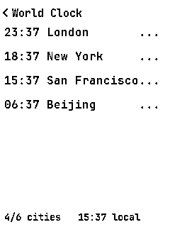
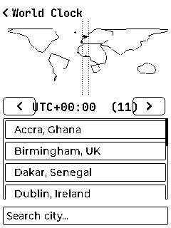
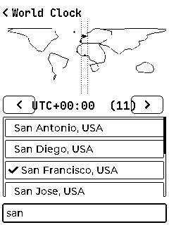

### Notes

Markdown notes in `/notes/`, with an edit page and a rendered preview.

| Key | Action |
|---|---|
| `e` | start editing |
| space, `m`, `s` | next page of the preview |
| `n`, `w` | previous page of the preview |
| Enter | cycle list / preview / edit pages |

While editing, every key goes into the text; backspace deletes and Enter saves and leaves.

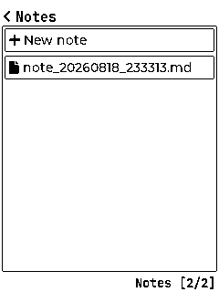

### Image viewer

PNG, JPEG and BMP from `/images/`, converted to grayscale then dithered to black and white. Images smaller than the screen are shown at original size; larger ones are fitted with the aspect ratio preserved.

| Key | Action |
|---|---|
| `w` `a` `s` `d` | pan |
| `i` / `o` | zoom |
| `n` / `m` | previous / next image |

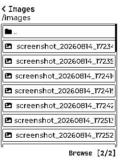

### Files

Starts a web server on the device's WiFi address. Browse the SD card from a laptop, download files, upload new ones, create and delete folders. The app shows the URL to open.

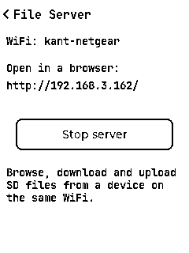
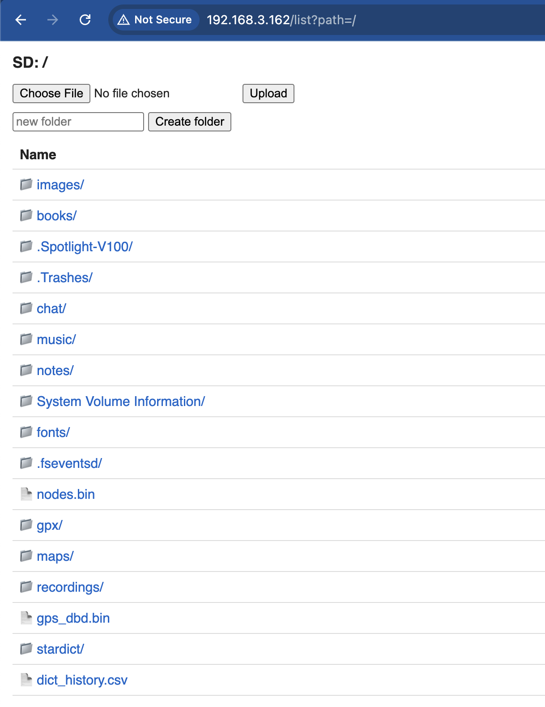

### Others

- **Calculator** — scientific, with full operator precedence, `sin`/`cos`/`tan`/`log`/`sqrt`/`exp`/factorial.
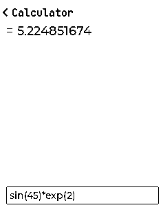
- **Calendar** — month view; `a`/`d` change month, optional public holidays.
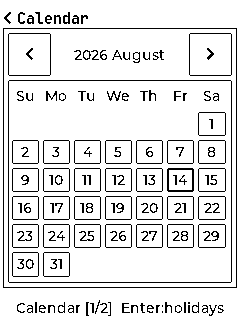
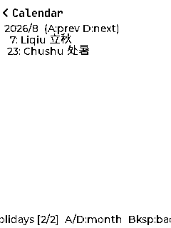
- **AI Chat** — conversation with Gemini over WiFi.

- **Recorder** — records to `/recordings/`; `+`/`-` adjust volume on playback.
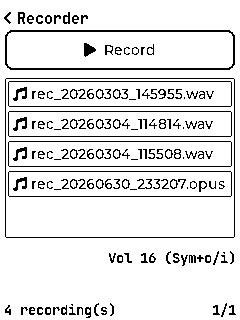
- **Music** — plays audio from `/music/` through the PCM5102A.
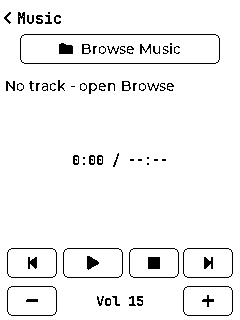
- **Hardware pages** — LoRa, WiFi, Settings, Test, Battery, Input, A7682E, Motor.

### Power behaviour

After five minutes with no key or touch activity the device drops to a low CPU clock and parks the radios nothing is using, keeping the current screen image (e-paper needs no power to hold it) with a small indicator top-right. Any key or touch restores full speed.

It deliberately does **not** use light sleep: on this board the keypad and touch interrupt lines could not wake it again, so the device had to be reset. Staying awake at a low clock keeps the keyboard responsive, which is worth more than the extra microamps.

Radios an app is actively holding are never parked — a GPS fix takes minutes of uninterrupted reception and generates no key activity, so idling used to cut the receiver's power mid-acquisition.

---

## Development notes

### Repository layout

```
examples/pda2/
  factory.ino          setup/loop, hardware init, shared SPI bus lock
  ui_deckpro.cpp       home menu, screen manager, hardware pages
  ui_*.cpp             one file per app
  peri_*.cpp           peripheral drivers (GPS, keypad, LoRa, …)
  app_config.*         settings from /config_keys.ini, with .h fallbacks
  power_mgr.*          reference-counted power rails
  lowpower_mgr.*       idle throttling
  garmin_img.*         Garmin .img map reader
  map_draw.*           1-bit map rasteriser
  map_store.*          map discovery and unpacking
  epub.* zip_reader.*  EPUB container
  md_parse/layout/view Markdown model, layout and rendering
  text_layout.*        line breaking, including CJK
  cjk_font.*           pre-rasterized CJK glyphs
  dict_lookup.*        StarDict
  city_db*             shared city database
  tools/               offline generators (fonts, city DB, maps)
```

### Host testing

The parsers are written so the tricky parts compile and run on a desktop, where a bug takes seconds to find rather than a reflash. `garmin_img.cpp` and `map_draw.cpp` abstract file I/O and build natively:

```bash
c++ -O1 -fsanitize=undefined -fno-sanitize-recover \
    -I examples/pda2 test.cpp examples/pda2/garmin_img.cpp -o test
```

UndefinedBehaviorSanitizer has caught real bugs this way (notably left-shifting negative coordinates, which only misbehaves in the southern and western hemispheres). Note that AddressSanitizer hangs at exit in some sandboxes; UBSan alone is reliable.

### Things worth knowing before changing code

- **The panel is the budget.** A full refresh is ~400 ms. Anything that repaints more than necessary — a blinking cursor, smooth scrolling, a progress animation — costs far more than the work it displays.
- **The SD bus is shared with the display.** Every SD access must hold `shared_spi_lock()` and call `shared_spi_prepare_device(BOARD_SD_CS)`.
- **SD is at 4 MHz** (the Arduino default) and FatFs is built **without fast-seek**, so a backward seek in a large file restarts the FAT cluster walk from the beginning. Code that reads big files sorts its reads into ascending order for this reason.
- **NVS is small.** The default partition is 20 KB — fine for settings, not for multi-kilobyte blobs. Those belong on the card.
- **Use PSRAM for anything large** (`ps_malloc`); internal RAM is scarce.

### Adding a setting

Settings come from `/config_keys.ini` on the card, falling back to
`config_keys.h`. Read them through `app_config.h` rather than the defines:

```c
#include "app_config.h"

if (!cfg_has(CFG_OWM_KEY)) { /* tell the user what is missing */ }
snprintf(url, sizeof(url), "...&appid=%s", cfg_get(CFG_OWM_KEY));
```

`cfg_get()` never returns NULL, so it is safe to pass straight to `printf`.
`cfg_source()` reports `"sd"`, `"firmware"` or `"unset"` without revealing the
value.

To add one: define a `CFG_*` key name in `app_config.h`, add a row to
`k_builtin[]` in `app_config.cpp` guarded by `#ifdef` on the matching
`config_keys.h` define, and list it in both `config_keys.ini.example` and the
table above.

Two conventions worth keeping:

- **Don't gate code on `#ifdef SOME_KEY`.** Those guards meant a build without
  a key didn't compile the path at all, so it could rot unnoticed and the user
  got a message naming a header they may not have. Runtime `cfg_has()` checks
  compile every path and can name the card file instead.
- **Never log a value.** `cfg_load()` prints key names and lengths only. A
  serial log is easy to paste into a bug report.

### Known gaps

- `wifi_ssid2` / `wifi_password2` are accepted by the config layer and appear
  in both templates, but nothing reads them — `power_mgr` only ever connects to
  the primary network. Wiring up a fallback is a small change.
- The map reader handles TRE and RGN but not LBL, so there are no map labels:
  no contour elevations, place names or road names.
- On-device unzipping of a map is capped at 6 MB uncompressed; larger archives
  must be unzipped on a computer.

---

## Credits

- LilyGo, for the T-Deck Pro hardware and the factory firmware this builds on
- [LVGL](https://lvgl.io/) 8.3
- The Garmin `.img` decoder is ported from `org.free.garminimg` by way of the Dart port at [vasilevzhivko/garmin_img](https://github.com/vasilevzhivko/garmin_img)
- [OpenTopoMap](https://garmin.opentopomap.org/) for the Garmin map builds
